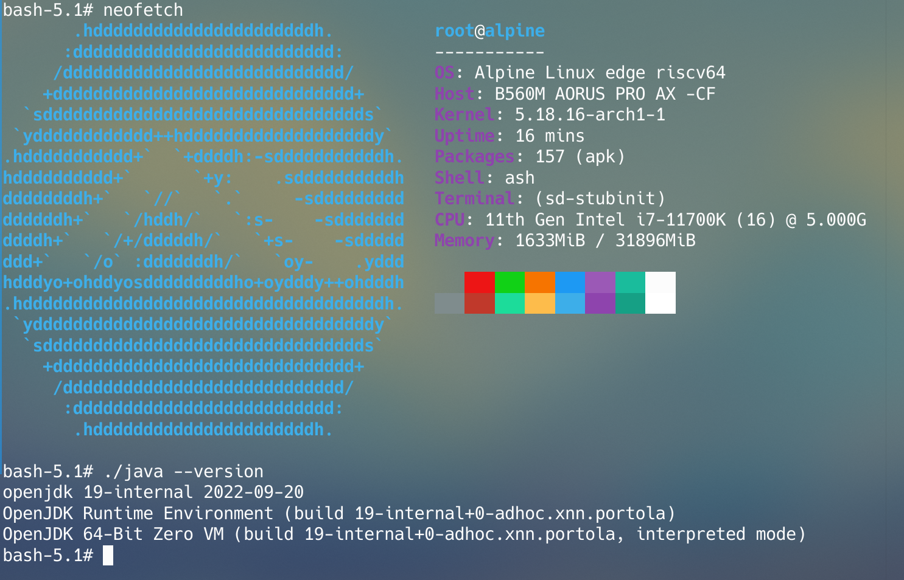
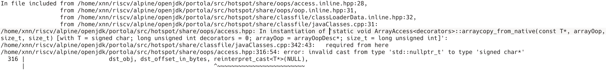

# 交叉编译安装RISCV下的Alpine下的openJDK



```bash
git clone git@github.com:openjdk/portola.git
cd portola
```

其后你需要搞一个alpine的rootfs环境，并在其中安装以下包

```bash
apk add libc-dev libx11-dev libxtst-dev libxt-dev libxrender-dev libxrandr-dev libxi-dev libxext-dev
apk add cups-dev fontconfig-dev alsa-lib-dev freetype libdwarf libstdc++
apk add wget git automake openssl file autoconf
```

其后假设你的rootfs在/path/to/rootfs路径下，后执行

```bash
bash configure --with-jvm-variants=zero \
 --openjdk-target=riscv64-unknown-linux-musl \
 --with-sysroot=/path/to/rootfs \
 --disable-warnings-as-errors \
 --x-includes=/path/to/rootfs/usr/include \
 --x-libraries=/path/to/rootfs/usr/lib
```

此时有个需要注意的地方，你需要把/src/hostspot/share/oops/access.hpp中所有的reinterpret_cast改成static_cast，否则会报如下错误



之后输入

```bash
make
```

即可编译，之后把linux-riscv64-zero-release/jdk移动到rootfs即可，例如

```bash
cd ./build/linux-riscv64-zero-release/
zip -r jdk.zip jdk
cp jdk.zip /path/to/rootfs/opt
```

之后在rootfs中

```bash
cd /opt/
unzip jdk.zip
```

